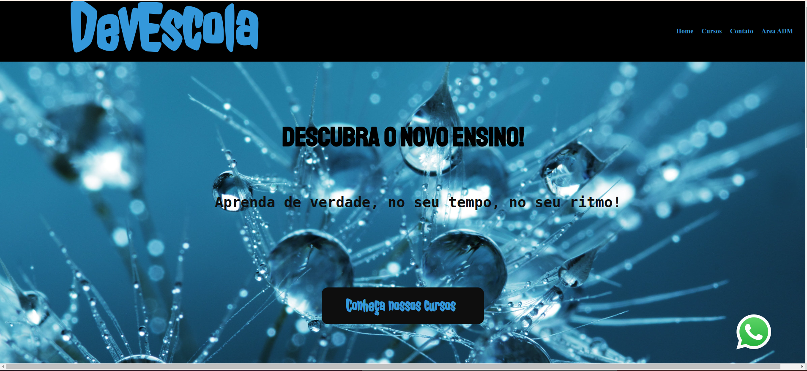
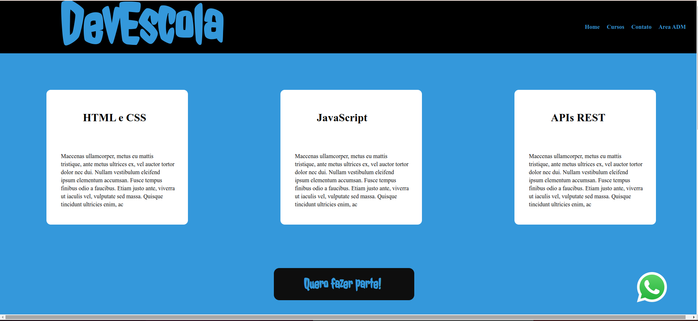
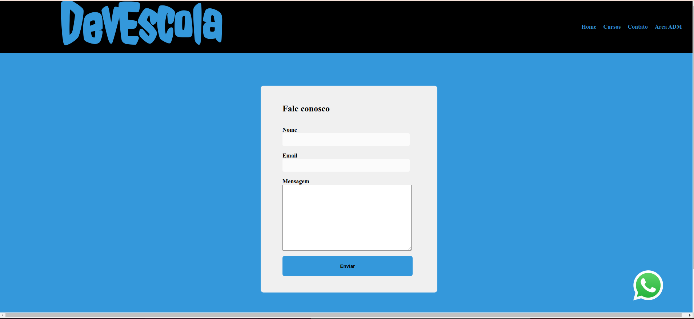
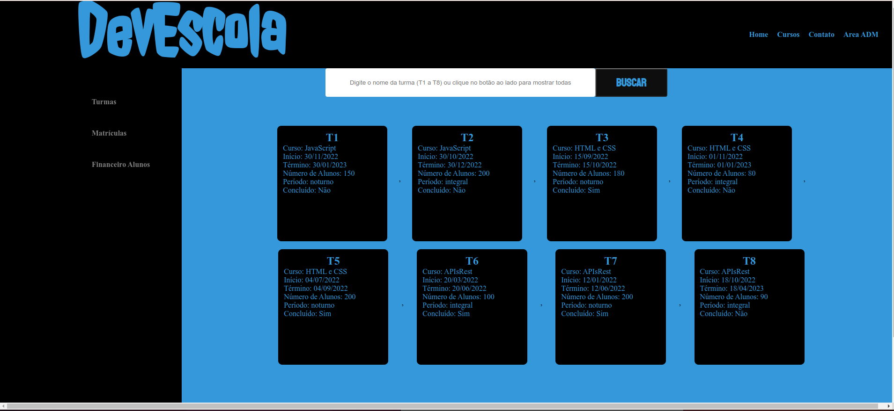
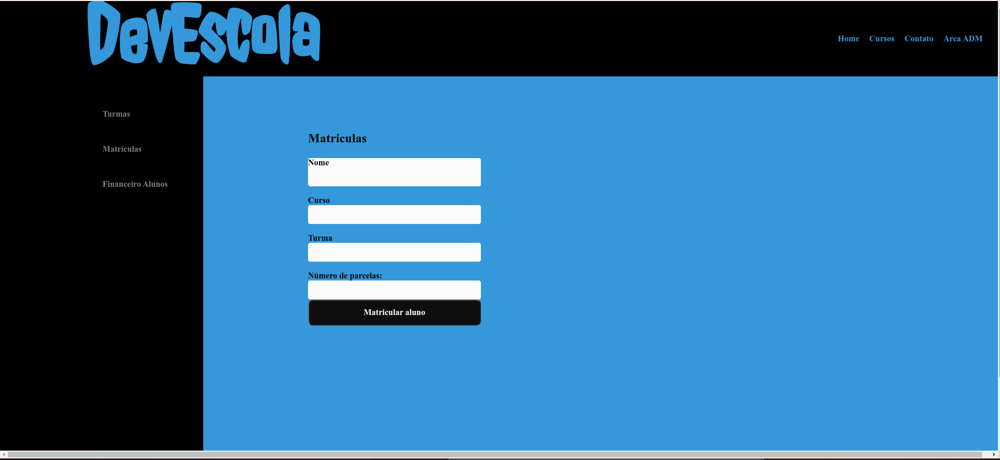
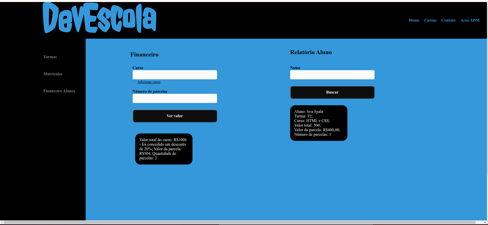

# DevEscola

Site de uma escola de programação onde é possível matricular novos alunos, pesquisar cursos e alunos matriculados e fazer simulações de compras de cursos.

### Tecnologias utilizadas
- HTML
- CSS
- JavaScript

### Como rodar este projeto
1. Faça o clone deste repositório com o comando
```bash
git clone https://github.com/carolcampos22/devschool.git
```
2. Entre na pasta do reposiorio e abra o arquivo index.html no navegador.

### Link do site
https://devschool-chi.vercel.app/

### Layout
1. Página inicial


2. Página de cursos


3. Página de contato


4. Página da Área ADM - Turmas


5. Página da Área ADM - Matrículas


6. Página da Área ADM - Financeiro/alunos


### Próximos passos
- Responsividade

<!-- Link do site: https://sable-steam.surge.sh/ -->

### Autora
#### Carolina Mendes - Web Developer
